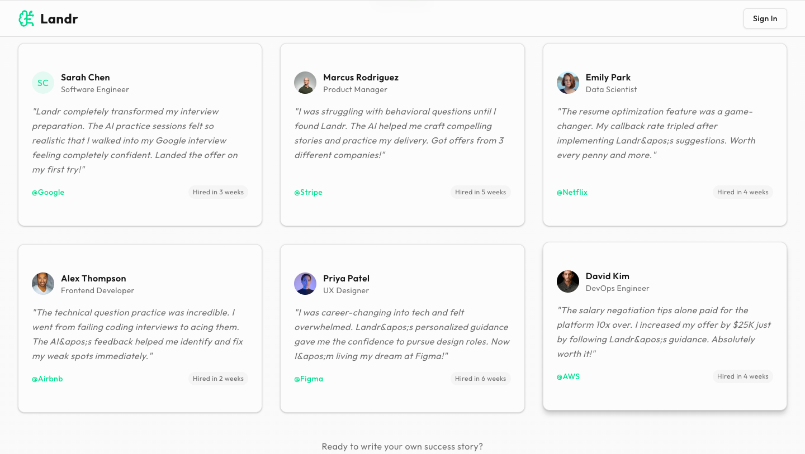
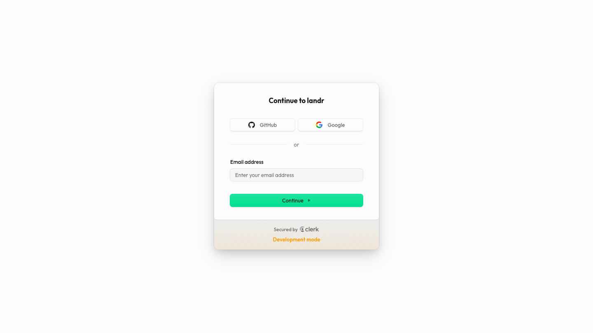
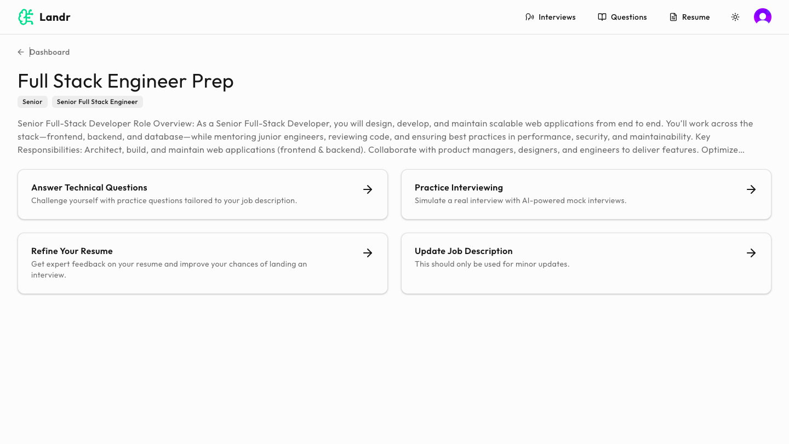
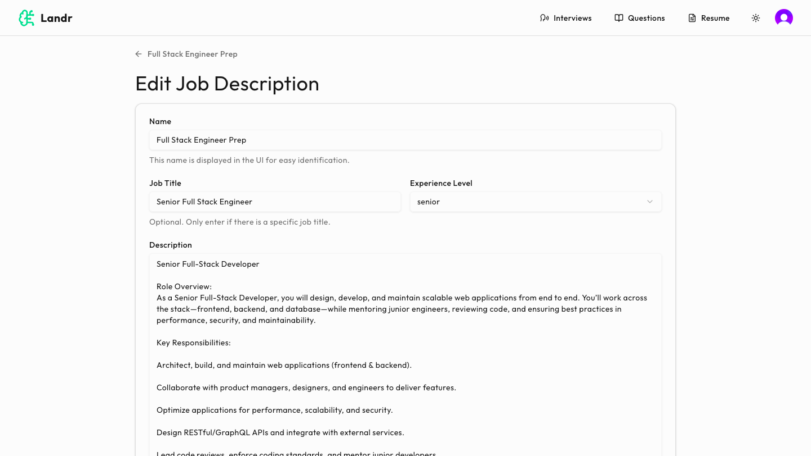
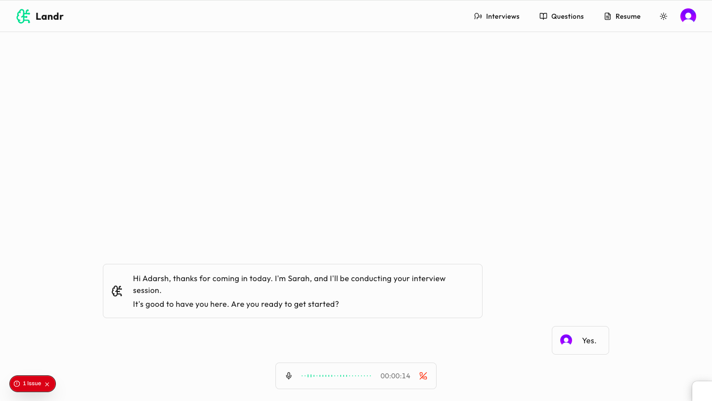
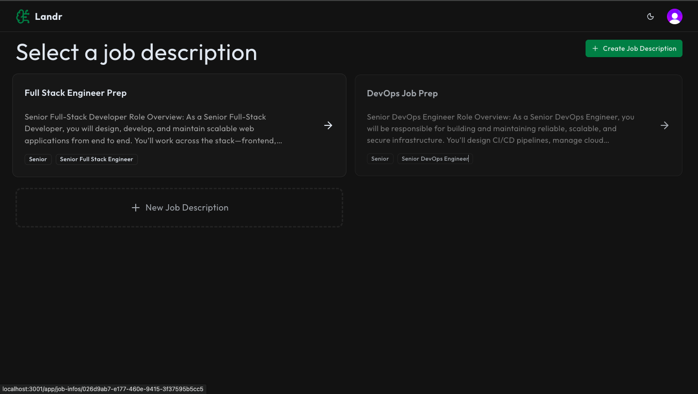

# 🚀 Landr – AI Job Prep Platform

Landr is a **full-stack AI-powered job preparation platform** designed to help candidates practice interviews, refine resumes, and receive real-time feedback. By combining **LLMs, emotion AI, and secure infrastructure**, Landr empowers users to become interview-ready with personalized insights.

**🌐 Live Demo:** [Access Landr](https://landr-web.vercel.app/)  
**🎬 Project Walkthrough:** [Watch on YouTube](https://youtube.com/your-video-link)

---

## ✅ Core Features

- 🤖 **AI-Powered Interview Practice** – Role-specific interview questions generated via Gemini API.
- 📝 **Resume Feedback** – Automated suggestions to improve clarity, structure, and role alignment.
- 🎤 **Real-Time Emotion & Tone Analysis** – Hume AI tracks delivery across 100+ practice sessions.
- 🔐 **Secure Authentication** – Clerk-based user auth & role management for 500+ user profiles.
- 🛡 **Fraud & Abuse Protection** – Arcjet integration blocking 1,000+ malicious requests.
- 📊 **Progress Tracking** – Monitor performance across multiple mock interviews.
- ⚡ **Scalable & Reliable** – 99.9% uptime with robust API integrations and PostgreSQL persistence.

---

## 🛠 Tech Stack

### **Client (Frontend)**

- ⚛️ **Next.js** – React-based framework with server and client rendering
- 🎨 **TailwindCSS, Shadcn UI, Lucide Icons** – Modern and responsive UI components
- 🔔 **Sonner** – In-app notifications
- 📡 **Axios** – API requests and data fetching

### **Server (Backend)**

- ⚡ **Express.js** – Lightweight Node.js backend framework
- 🗄 **PostgreSQL + Prisma ORM** – Relational database with schema management
- 🛡 **Arcjet** – Security & request protection
- 🔐 **Clerk** – Authentication, authorization, and session management
- 🧠 **Gemini API** – Role-specific interview question generation
- 🎤 **Hume AI** – Emotion and tone analysis for real-time interview feedback

---

## Environment Variables

To run this project, you will need to set the following environment variables in your `.env` file:

- `NEXT_PUBLIC_CLERK_PUBLISHABLE_KEY`
- `CLERK_SECRET_KEY`
- `NEXT_PUBLIC_CLERK_SIGN_IN_URL`
- `NEXT_PUBLIC_CLERK_SIGN_IN_FALLBACK_REDIRECT_URL`
- `NEXT_PUBLIC_CLERK_SIGN_UP_FORCE_REDIRECT_URL`
- `CLERK_WEBHOOK_SIGNING_SECRET`
- `ARCJET_KEY`
- `DATABASE_URL`
- `HUME_API_KEY`
- `HUME_SECRET_KEY`
- `NEXT_PUBLIC_HUME_CONFIG_ID`
- `GEMINI_API_KEY`

## 🚀 Installation & Running Locally

Follow these steps to set up and run **Collabydraw**:

```bash
# Clone the repository
git clone https://github.com/devadarshh/landr.git
cd landr

# Install dependencies
npm install

npm run dev

```

--

## 📸 Screenshots

### Landing Page I


### Landing Page II



### Sign In Page



### Job Dashboard


### Job Info Page



### Edit Job Info Page



### Job Interview Page



### Dark Mode Page



## 📄 License

This project is licensed under a **Custom Personal Use License** — you may view and learn from the code, but **commercial use, redistribution, or claiming authorship is strictly prohibited**.
See the full [LICENSE](./LICENSE) for details.
