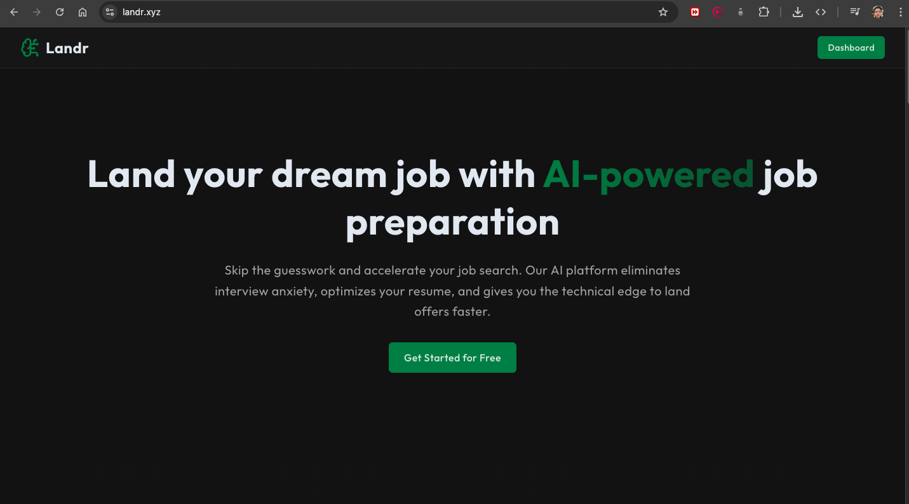
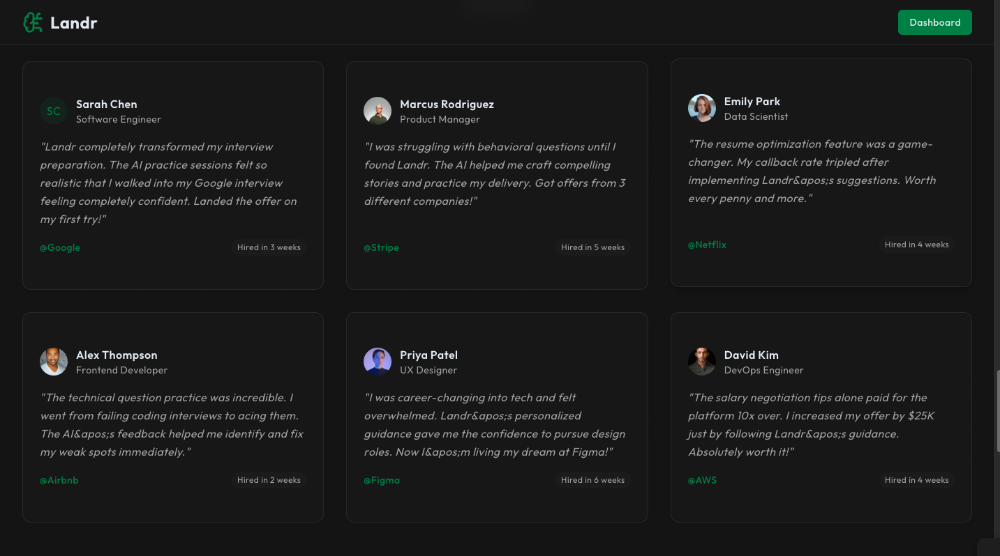
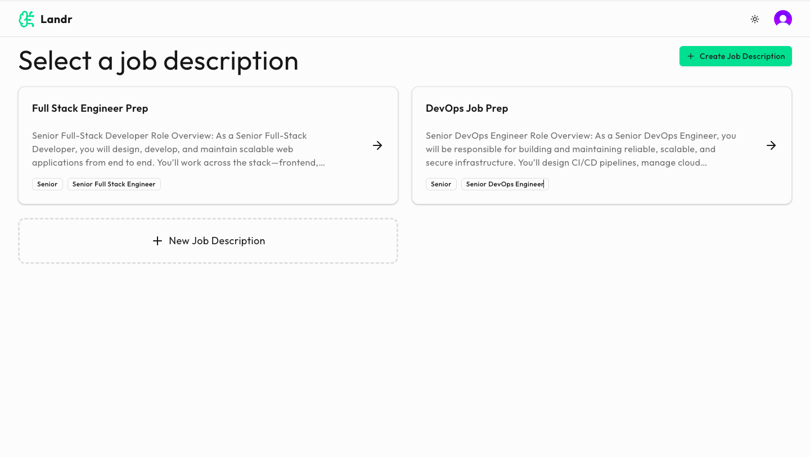
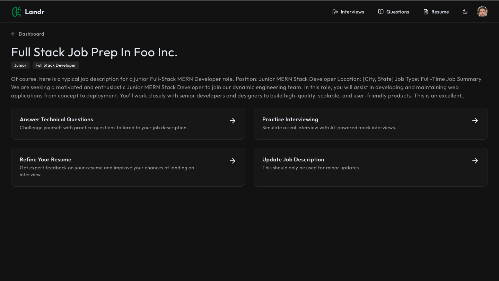
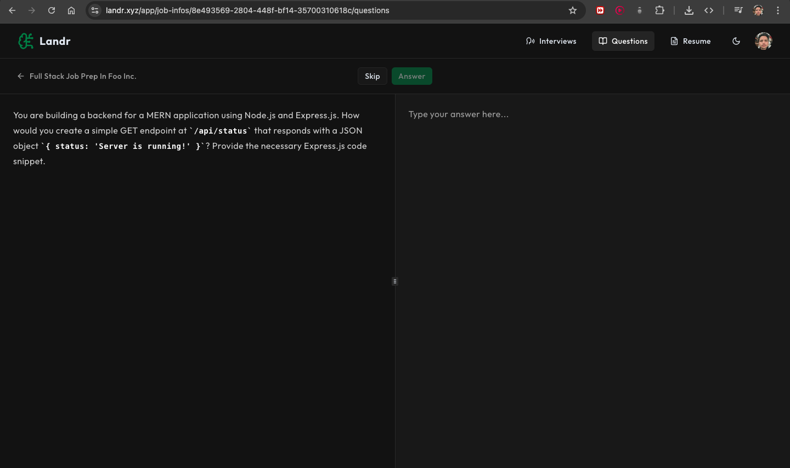
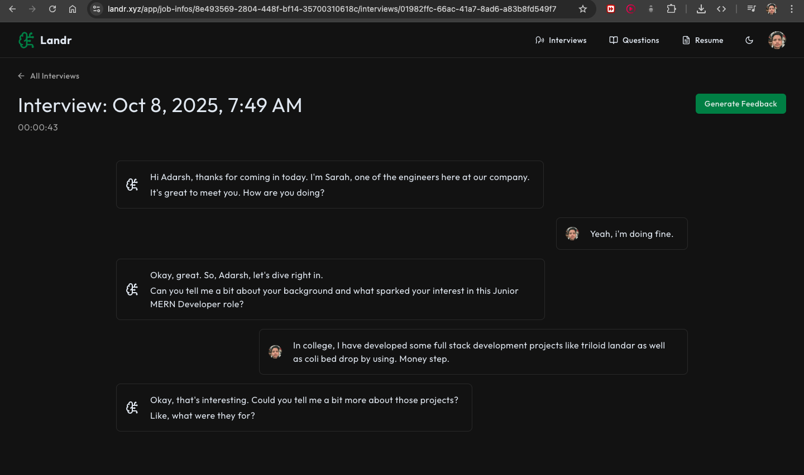
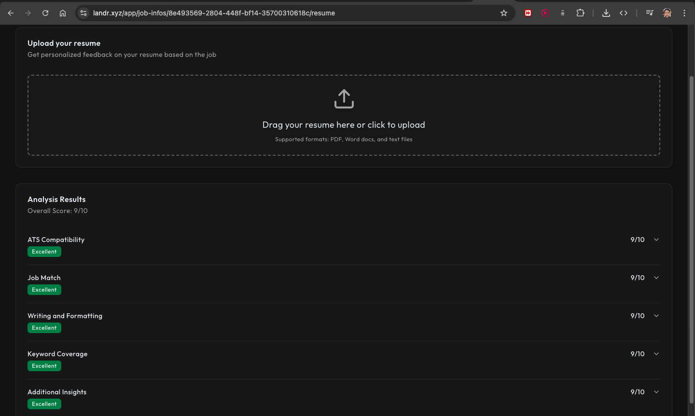

# 🚀 Landr – AI Job Prep Platform

Landr is a **full-stack AI-powered job preparation platform** designed to help candidates practice interviews, refine resumes, and receive real-time feedback. By combining **LLMs, emotion AI, and secure infrastructure**, Landr empowers users to become interview-ready with personalized insights.

**🌐 Live Demo:** [Access Landr](https://landr.adarshsingh.xyz)  
**🎬 Project Walkthrough:** [Watch on YouTube](https://youtu.be/Gb1TpmxnijY?si=AJVjR85zt8hG_0sb)

---

## ✅ Core Features

- 🤖 **AI-Powered Interview Practice** – Role-specific interview questions generated via Gemini API.
- 📝 **Resume Feedback** – Automated suggestions to improve clarity, structure, and role alignment.
- 🎤 **Real-Time Emotion & Tone Analysis** – Hume AI tracks delivery across 100+ practice sessions.
- 🔐 **Secure Authentication** – Clerk-based user auth & role management for 500+ user profiles.
- 🛡 **Fraud & Abuse Protection** – Arcjet integration blocking 1,000+ malicious requests.
- 📊 **Progress Tracking** – Monitor performance across multiple mock interviews.
- ⚡ **Scalable & Reliable** – 99.9% uptime with robust API integrations and PostgreSQL persistence.

---

## 🛠 Tech Stack

### **Client (Frontend)**

- ⚛️ **Next.js** – React-based framework with server and client rendering
- 🎨 **TailwindCSS, Shadcn UI, Lucide Icons** – Modern and responsive UI components
- 🔔 **Sonner** – In-app notifications
- 📡 **Axios** – API requests and data fetching

### **Server (Backend)**

- ⚡ **Next.js** – Lightweight backend framework
- 🗄 **PostgreSQL + Drizzle ORM** – Relational database with schema management
- 🛡 **Arcjet** – Security & request protection
- 🔐 **Clerk** – Authentication, authorization, and session management
- 🧠 **Gemini API** – Role-specific interview question generation
- 🎤 **Hume AI** – Emotion and tone analysis for real-time interview feedback

---

## 🚀 Installation & Running Locally

Follow these steps to set up and run **Landr**:

```bash
# Clone the repository

git clone https://github.com/devadarshh/landr.git

# Navigate into the project directory

cd landr

# Install dependencies

npm install

# Create a .env file and configure the required environment variables

touch .env

#  Start the development server

npm run dev

```

## 🌐 Production Domain & Authentication

The production site is hosted at [landr.adarshsingh.xyz](https://landr.adarshsingh.xyz). For Clerk authentication on this domain:

- Use the production Clerk publishable and secret keys in the deployment environment.
- Set the Clerk application domain and allowed redirect origins to `https://landr.adarshsingh.xyz` in the Clerk Dashboard.
- Set the following Clerk environment variables in the deployment environment:

```env
NEXT_PUBLIC_CLERK_SIGN_IN_URL=/sign-in
NEXT_PUBLIC_CLERK_SIGN_UP_URL=/sign-up
NEXT_PUBLIC_CLERK_SIGN_IN_FORCE_REDIRECT_URL=/app
NEXT_PUBLIC_CLERK_SIGN_UP_FORCE_REDIRECT_URL=/app
```

The app provides `/sign-in` and `/sign-up` routes. Clerk redirects users to `/app` after they authenticate.

## 📸 Screenshots

### Landing Page I



### Landing Page II



### Job Description



### Job Dashboard



### Technical Question



### Job Interview Page



### Resume Analysis Page



### Light Mode Page


## 📄 License

This project is licensed under a **Custom Personal Use License** — you may view and learn from the code, but **commercial use, redistribution, or claiming authorship is strictly prohibited**.
See the full [LICENSE](./LICENSE) for details.
